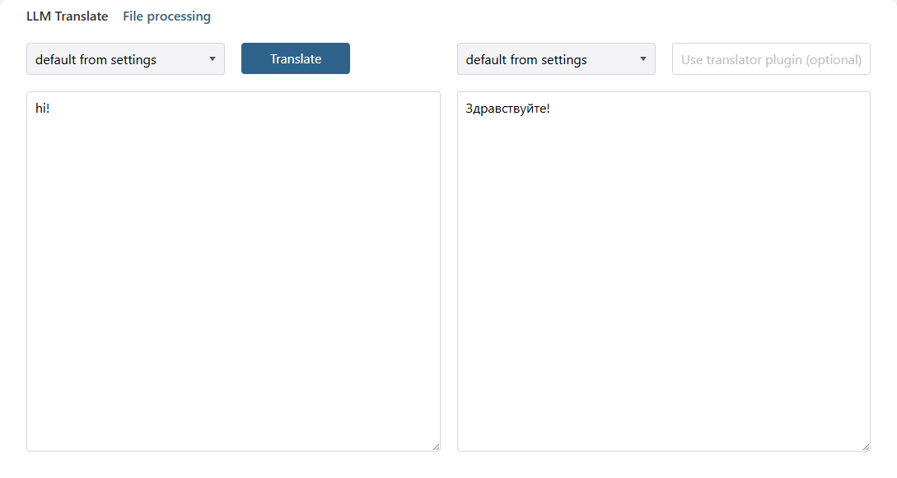

# LLM translate

Сервис, ориентированный на оффлайн перевод текстов и файлов с использованием LLM (Large Language Model) или более специфичных моделей, 
таких как nllb-200 или madlad-400.

Возможности:
* Поддерживается различные системы для перевода - как внутренние, так и внешние.
* Работа как через интерфейс, так и запросы к API.
* Предварительная обработка текста (как исходного, так и переведенного) для улучшения результата перевода.
* Кэширование результатов.
* Перевод файлов, с возможностью частичного перевода для некоторых форматов файлов.

## Начало работы

[Установка и запуск](install.md)

[Настройки сервиса и модулей (плагинов)](options.md) 

## Перевод

[Перевод текста](translate_text.md)

[Перевод файлов](processing_files.md)

## API

Проект поддерживает Swagger-UI, в котором можно увидеть все методы API.
Доступен по адресу host:port/docs, по умолчанию - http://127.0.0.1:4990/docs

## Web-интерфейс

Также поддерживается базовый веб-интерфейс, позволяющий быстро начать работу с сервисом.

Он доступен по адресу http://127.0.0.1:4990, и выглядит так:

## Структура проекта

* `/app` - папка с python-файлами, которые используются плагинами и API-контроллером.
* `/cache` - папка для сохранения файла базы кэша по умолчанию. [Документация](doc/ru/options.md).
* `/doc` - документация
* `/files_processing` - директория для обработки/перевода файлов по умолчанию.
  в `/files_processing/in` помещаются файлы для обработки, в папке `/files_processing/out` создаются результаты обработки.
  [Документация](doc/ru/processing_files.md).
* `/models` - папка по умолчанию для размещения моделей для перевода, таких как madlad-400 или nllb-200.
  [Документация](doc/ru/translate_text.md).
* `/options` - папка с настройками сервиса и плагинов. [Документация](doc/ru/options.md).
* `/plugins` - папка с python-файлами плагинов, перевода и обработки файлов.
* `/resources` - папка с файлами ресурсов проекта, такими, как файл конфигурация логов, файлы миграции базы данных кэша.
* `/static` - папка с html, css, js файлами для веб-интерфейса.
* `/test` - файлы unit-тестов для исходного кода.
* `compose.yaml` - файл с настройками для запуска Docker-контейнера. [Документация](doc/ru/install.md).
* `Dockerfile` - файл с настройками создания Docker-контейнера. [Документация](doc/ru/install.md).
* `jaa.py` - библиотека управления плагинами.
* `requirements.txt` - внешние зависимости проекта.

